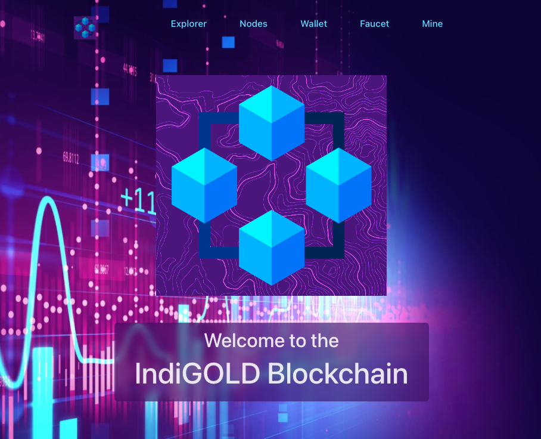

<!-- PROJECT LOGO -->

 

    

  <h3 align="center">IndiGOLD Blockchain - The README.md File</h3>
  

 

# IndiGOLD Blockchain

IndiGOLD Blockchain is an implementation of a fully functional blockchain network consisting of nodes, miners, wallet and faucet apps, and a blockchain explorer.

<!-- TABLE OF CONTENTS -->

  
Table of Contents

  <ol>
    <li>
      <a href="#about-the-project">About The Project</a>
      <ul>
        <li><a href="#project-overview">Project Overview</a></li>
      </ul>
      <ul>
        <li><a href="#technical-requirements">Technical Requirements</a>
      </ul>
      <ul>
        <li><a href="#team-response-to-requirements">Team Response to Requirements</a></li>
      </ul>
      <ul>
        <li><a href="#built-with">Built With</a></li>
      </ul>
    </li>
    <li><a href="#github-repo-and-usage">GitHub Repo and Usage</a></li>
    <li><a href="#known-issues">Known Issues</a></li>
    <li><a href="#license">License</a></li>
    <li><a href="#contact">Contact</a></li>
    <li><a href="#acknowledgments">Acknowledgments</a></li>
  </ol>

<!-- ABOUT THE PROJECT -->

## About The Project

### Project Overview

The IndiGOLD Blockchain application is a class project for the <a href="https://kingslanduniversity.com/zero-to-blockchain-developer-program/">Kingsland University 'Zero to Blockchain' Program.</a> Our application leverages the React frontend library to illustrate the functionality of a complete proof-of-work blockchain network.
 

### Technical Requirements

Build a proof-of-work blockchain system that includes:

- Nodes
- Miners
- Faucet
- Wallets
- Explorer

Build a blockchain network server and implement a RESTful API for client-server communiation. The frontend shall include:

- Explorer
- Wallet
- Faucet
- Nodes Monitoring
- Mining Dashboard

Workflow: Use GitHub for version control. Each team member shall make a minimum of two pull requests.

(<a href="#top">back to top</a>)

### Team Response to Requirements

<ol>
    <li>Backend: Node.js and JavaScript</li>
    <li>Frontend: React and Vite</li>
    <li>Websockets are used to stream data from the backend and display real-time hash rate values on the frontend.</li>
</ol>

(<a href="#top">back to top</a>)

<ol>
    <li>A GitHub repository was created.</li>
    <li>Team members were added as collaborators.</li>
    <li>Collaborators cloned the repo & each started a new branch.</li>
    <li>Collaborators on GitHub:</li>
    <ul>
      <li>used Pull Requests, making sure to tag a reviewer for approval.</li>
      <li>did not commit anything directly to the Main branch.</li>
      <li>worked on branches of Main and merged our work through Pull Requests.</li>
      <li>had other teammates be Reviewers for their Pull Requests.</li>
    <ul>  
</ol>

(<a href="#top">back to top</a>)

### Built With

- [node.js](https://https://nodejs.org)
- [React](https://https://react.dev)
- [Vite](https://vitejs.dev)

(<a href="#top">back to top</a>)

<!-- USAGE  -->

## GitHub Repo and Usage

Visitors are encouraged to go to our GitHub repository to examine the code behind the functionality of the web app.

GitHub Link: [https://https://github.com/tarenpang/blockchain](https://https://github.com/tarenpang/blockchain)

<ol>
    <li>`npm install` in each of the following directories:</li>
    <ol>
      <li>blockchain</li>
      <li>backend</li>
      <li>frontend</li>
</ol>

<li>Start the app in the blockchain directory: `npm run start`</li>

(<a href="#top">back to top</a>)

<!-- ROADMAP -->

## Known Issues

The following are known, open issues:

<ol>
  <li><b> Competitive mining is not fully implemented</b> Competitive mining among miner nodes is stretch goal that has not been fully implemented. The framework has been established to set the number of child processes independently for each node to simulate varying miner processing capacities. However, the way the local hosting computer allocates resources to running processes may be skewing the mining results. In other words, nodes that have more concurrent child processes are not always the fastest to reach the required difficulty. We are in the process of investigating methods for correcting these skewed results.</li> 
  <li><b>Application is not optimized for mobile-first, responsive design.</b>The frontend can be improved to provide a better user experience. In particular, rendered elements can be made to be more responsive on mobile devices. Our team will be looking at ways to implement this on the next iteration of the application.</li> 
</ol>

(<a href="#top">back to top</a>)

<!-- LICENSE -->

## License

Distributed under the MIT License.

(<a href="#top">back to top</a>)

<!-- CONTACT -->

## Contact

https://www.linkedin.com/in/marcellusbrady/

https://www.linkedin.com/in/joshua-baum-627a0a217/

https://www.linkedin.com/in/taren-pang-5430ab14/

(<a href="#top">back to top</a>)

<!-- ACKNOWLEDGMENTS -->

## Acknowledgments

This project would not have been possible without the support and encouragement of the following individuals:

<ol>
  <li>Our instructors: <b>Simeon Mandazhiev</b> and <b>Patrick Galloway</b> <a href="https://kingslanduniversity.com/">Kingsland University</a> for expertly guiding us through the course.</li> 
  <li>Administrators: <b>Ma Deezan Gavilla</b> and <b>Rhochelle Kadusale</b> for keeping us on track on the administrative side of things.</li> 
</ol>

(<a href="#top">back to top</a>)

